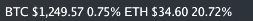

# electron-btc-ticker

> Displays BTC/ETH ticker on the Mac OS X top menu bar.




## Development

```bash
npm install
npm start
```

## Build

```bash
npm run build
```

## Mac OS X app

Download app and double click to run

```bash
wget https://github.com/miguelmota/electron-btc-ticker/tree/master/BTC-ETH%20Ticker-darwin-x64/BTC-ETH%20Ticker.app
```

# License

MIT

